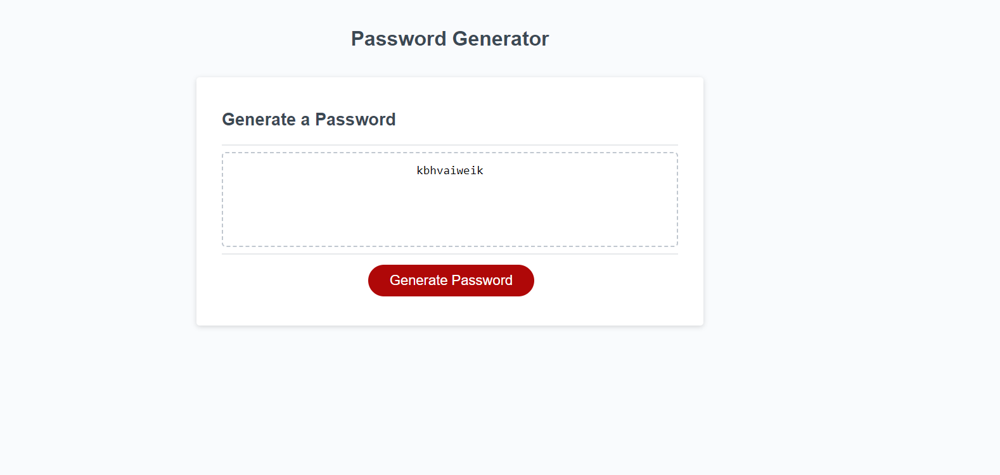

# Password Generator Starter Code
Password Generator
A simple tool that allows you to generate a random password based on your desired length and character types.

Features
Prompts the user for the password length and character types to include (lowercase letters, uppercase letters, numbers, special characters)
Validates the user's input to ensure that the password length is between 8 and 128 characters, and at least one character type is selected
Generates a password using the specified length and character types
Displays the generated password in a text area
Requirements
A modern web browser (such as Google Chrome or Mozilla Firefox)
Usage
Open the password generator in your web browser
Click the "Generate Password" button
Enter the desired password length (8-128 characters) and select the character types to include
Click the "OK" button to generate the password